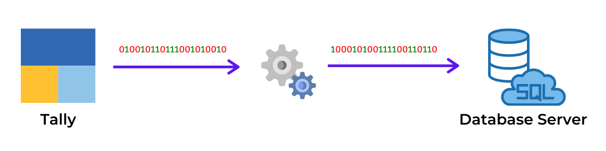

# Tally to Database Server: Data Loader Utility



Commandline utility to load data into Database Server from Tally software, intended for further use by
* MS Excel / Google Sheet (for tabular reports)
* Power BI / Google Data Studio (for dashboards)

## Index
* [Version](version)
* [Requirements](#requirements)
* [Download](#download)
    * Utility
    * Tally
    * Node JS
    * SQL Server
    * MySQL Server
    * MariaDB Server
* [Tally XML Server](#tally-xml-server)
    * Tally Prime
    * Tally.ERP 9
* [Database Creation](#database-creation)
* [Utility Installation](#utility-installation)
* [Configuration Setup](#configuration-setup)
    * Database Connection
    * Tally Options
* [Steps](#steps)
* [Tutorial](#tutorial)
* [Tally Export Config](#tally-export-config)
* [Commandline Options](#commandline-options)
* [Logs](#logs)
* [Reports](#reports)
* [Power BI Template](#power-bi-template)
* [Google BigQuery Database CSV loading](#google-bigquery-database-csv-loading)
* [Develop Further](#develop-further)
* [License](#license)
* [Contact](#contact)
* [Frequently Asked Questions](#frequently-asked-questions)
* [Release History](#release-history)

<br><br>

## Version
Latest Version: **1.0.7**<br>
Updated on: **23-Jun-2021**

*Note: We have revamped utility. So, kindly delete existing utility installation. Configuration file has changed, so it needs to be revised*

<br><br>

## Requirements
Utility requires installation of following as a pre-requisite
* Windows 10
* Tally.ERP 9 / Tally Prime
* Node JS
* SQL Server / MySQL Server / MariaDB Server

Compatibility:
* SQL Server - version 2019
* MySQL - version 8.x

**Note:** *Utility and SQL Queries for reports are deviced considering latest version of SQL Server / MySQL Server. Running it in lower version might hamper few of the functionalities, as some SQL syntax were introduced in latest version of these Database Server*

<br><br>

## Download

### Utility
Database Loader Utility is portable, and does not have a setup wizard like we find for software installation. Zip archive of utility can be downloaded from below link

[Download Database Loader Utility](https://excelkida.com/resource/tally-database-loader-utility-1.0.7.zip)

Also, it is a commandline utility having no window interface (to keep it minimal and faster)

### Tally
Utility is currently compatible for both Tally.ERP 9 and Tally Prime. Future releases of utility will be tested and updated for Tally Prime only (as ERP 9 will not receive feature updates). Also, database structure of Utility will be updated aligned to Tally Prime.

[Download Tally Prime](https://tallysolutions.com/download/)

### Node JS
Node.JS is an open-source javascript compiler running on cross platform V8 engine (used by Google Chrome & Microsoft Edge browser). This utility require latest (or stable) version of Node.JS installed in system. It can be downloaded from official website of Node.JS

[Download Node.JS](https://nodejs.org/en/)

### SQL Server
Microsoft SQL Server is the prefered Database Server solution, when it comes to Windows OS.
Microsoft offers **Express (free)** version of SQL Server which can be used for personal use (with certain limitations on database size).

[Download Micrsoft SQL Server 2019 - Express Edition](https://www.microsoft.com/en-ie/sql-server/sql-server-downloads)

### MySQL Server
Oracle MySQL Server is an open-source Database Server compatible on both Windows and Linux OS. It has best performance in Linux-based Operating Systems.
Oracle offers **Community (free)** version of MySQL Server, which can be used for personal use.

[Download MySQL Server 8.x - Community Edition](https://dev.mysql.com/downloads/mysql/)


### MariaDB Server
MariaDB is a complete open-source Database Server available freely which is a drop-in replacement to MySQL Server, and is an emerging option among database community.

[Download Maria DB Server](https://mariadb.org/download/)

<br><br>

## Tally XML Server
Tally has in-built XML Server capability, which can import/export data in/out of Tally. This utility sends export command to Tally along with report specification written in TDL (Tally Developer Language) in XML format. In response, Tally returns back the requested data (in CSV format), which is then imported into Database Server. This utility works for both Tally.ERP 9 and Tally Prime both. Kindly ensure that XML Server of Tally is enabled (one-time). Avoid running Tally Prime & ERP.9 both at same time, as by default, both of them would try to block port numbert 9000 for XML Server. If you still need to run both simulteneously, change the port number of Tally Prime, or you can also disable XML Server of any of the Tally instance.

### Tally.ERP 9
* Gateway of Tally > Configure (F12) > Advanced Configuration
* Set Tally.ERP 9 is acting as **Both**

### Tally Prime
* Help (F1) > Settings > Connectivity
* Client/Server configuration
* Set TallyPrime is acting as **Both**

<br><br>


## Database Creation
Database first needs to be created and then Tables needs to be created in which data from Tally will be loaded, before running utility. File **database-structure.sql** contains SQL for creating tables of database. Just ensure to create database using any of GUI Database Manager. That database name should be updated in **schema** property of *config.json*. Open-source database editor available freely are
* [SQL Server Management Studio (SQL Server)](https://docs.microsoft.com/en-us/sql/ssms/download-sql-server-management-studio-ssms)
* [MySQL Workbench (MySQL Server)](https://dev.mysql.com/downloads/workbench/)
* [Azure Data Studio (SQL Server - Lightweight)](https://docs.microsoft.com/en-us/sql/azure-data-studio/download-azure-data-studio)

Utility support import into database server installed and hosted on
* Same PC where Tally is
* On any machine on LAN
* Virtual Private Server
* Cloud Database [ Microsoft Azure / Amazon Web Services (AWS) / Google Cloud Platform / Oracle Cloud ]

<br><br>

## Configuration Setup
Utility contains a file **config.json** containing database connection and tally related settings.

<br>

### Database Connection
Database Connection credentials needs to be set in the file in **database** section of *config.json*. A sample configuration file

**SQL Server**
```json
"database": {
    "technology": "mssql",
    "server": "localhost",
    "port": 1433,
    "schema": "<database_name>",
    "username": "sa",
    "password": "<your_password>",
    "loadmethod": "insert"
}
```
<br/>

**MySQL / MariaDB Server**
```json
"database": {
    "technology": "mysql",
    "server": "localhost",
    "port": 3306,
    "schema": "<database_name>",
    "username": "root",
    "password": "<your_password>",
    "loadmethod": "insert"
}
```

| Settings | Value |
| --- | --- |
| technology | **mssql**: Microsoft SQL Server<br>**mysql**: MySQL Server or MariaDB Server<br>**csv**: Generate CSV dump for further import (below parameters of database connection are dummy when CSV setting is applied) |
| server | IP Address of PC on which Database Server is hosted (**localhost** = same machine) |
| port | Port number on which Database Server is listening<br>**mssql**: Default port is **1433**<br>**mysql**: Default port is **3306** |
| schema | Database name in which to insert data |
| username | Username<br>**mssql**: Default user is **sa** <br>**mysql**: Default user is **root** |
| password | Password for corresponding user. It is set during installation of Database Server.<br>*Note: Trusted Login (password-less) of SQL Server not supported by this utility* |
| loadmethod | **insert**: loads rows in database tables using SQL query with multiple rows. This is most compatible method which works everywhere (Compatibility: **High** / Performance: **Slow** ) <br> **file**: loads rows in database table using file based loading method. This method works only when database server and utility is running on same machine. So this method is not compatible with Cloud databases (Compatibility: **Low** / Performance: **Fast** ) |

Kindly override configurations, as per respective Database Server setup

**Note**: *Utility supports SQL Server connection via TCP/IP port only. This option is disabled by default, which needs to be enabled. Kindly refer FAQ where it has been elaborated in detail along with screenshots*
 (applicable for Microsoft SQL Server only)

<br>

### Tally Options
Few of the options of Tally may need modification, if default settings of Tally are specifically over-ridden (due to port clashes). A sample configuration of tally is demonstrated as below

```json
"tally": {
     "server": "localhost",
     "port": 9000,
     "master": true,
     "transaction": true,
     "fromdate" : "20190401",
     "todate" : "20200331",
     "company": ""
}
```

| Setting | Value |
| --- | --- |
| server | IP Address or Computer Name on which Tally XML Server is running (**localhost** is default value equivalent of IP Address 127.0.0.1). Change this if you need to capture data from a Tally running on different PC on your LAN |
| port | By default Tally runs XML Server on port number **9000**. Modify this if you have assigned different port number in Tally XML Server settings (typically done when you want run Tally.ERP 9 and Tally Prime both at a same time parallely, where you will be changing this port number) |
| master / transaction | **true** = Export master/transaction data from Tally (*default*) <br> **false** = Skip master/transaction data |
| fromdate / todate | **YYYYMMDD** = Period from/to for export of transaction and opening balance (in 8 digit format) <br> **auto** = This will export complete transactions (irrespective of selected Financial Year) from Tally by auto-detection of First & Last date of transaction |
| company | Name of the company from which to export data or leave it blank to export from Active company of Tally (this parameter is intended for use when user needs to export data from specific company irrespective of it is active or not. Setup a powershell script to run a loop when multiple companies needs to be targeted one-by-one) |

<br><br>

## Steps
1. Create database in Database Server along with tables inside it (use **database-structure.sql** to create tables)  [ignore if already created]
1. Ensure options are properly set in **config.json**
1. Ensure Tally is running and target company from which to export data is Active
1. Run the file **run.bat**
1. Commandline window will open, attempt to import data and will get closed after import/error
1. Check for import status in **import-log.txt** file and errors (if any) in **error-log.txt** file

<br><br>

## Tutorial

YouTube tutorial video are availabe (link below)

**SQL Server**
<br>

[](https://www.youtube.com/watch?v=Am0uspXtTzM)

<br>

**MySQL Server**
<br>

[](https://www.youtube.com/watch?v=_bXc54bKTlI)

<br><br>

## Tally Export Config
Certain times we may require to add or remove any of the fields from export (to add user defined fields created by TDL Developer in Tally customisations). So this export specification is defined in **tally-export-config.yaml** file in YAML format. This file is divided into Master and Transaction, containing multiple tables in it. To understand structure and nomenclature, an example of this is given below

```yaml
master:
    - name: mst_group
      collection: Group
      fields:
        - name: guid
          field: Guid
          type: text
```

name: mst_group (**Database Table name**)<br>
collection: Group (**Tally Collection name**)<br>
name: guid (**Database Column name**)<br>
field: Guid (**Tally field name**)<br>
type: **text / logical / date / number / amount / quantity / custom**

**amount:** Credit = positive / Debit = negative<br>
**quantity:** In Quantity = positive / Out Quantity = negative<br>
**custom:** Any custom expression in TDL format

<br><br>

## Commandline Options
Utility is completely driven by configuration specified in **config.json** file. In case if specific configuration(s) needs to be overriden without changing it in config file, it can be done using commandline switches as follows:

```bat
node ./dist/index.js [[--option 01] [value 01] [--option 02] [value 02] ...]
```

**option**: Syntax for option is **--parent-child** , *parent* is the main config name followed by *child* is the sub-config name in **config.json** . (Refer example for further explanation)

**value**: Value of config for corresponsing option

### Examples:

**Scenario 01:** We have created separate databases for individual clients & currently need to load data of client in database named **airtel** in SQL Server, with rest of the settings unchanged, then below is the command for desired output
```bat
node ./dist/index.js --database-schema airtel
```

**Scenario 02:** We need to set from & to date dynamically (without changing config file), lets say **FY 2019-20 Q3**, then below is the command for that
```bat
node ./dist/index.js --tally-fromdate 20191001 --tally-todate 20191231
```

**Scenario 03:** You have a tally company named *Reliance Industries*, created database of it by name *client_reliance* and want to export **FY 2019-20**  Then below is the command for that
```bat
node ./dist/index.js --tally-fromdate 20191001 --tally-todate 20191231 --tally-company "Reliance Industries" --database-schema client_reliance
```


**Scenario 04:** You are using Amazon Web Services (AWS) as database server, and have multiple servers for each client group of companies with multiple separate database for each subsidiary company. You intend to sync data for **FY 2020-21** from Tally into **Jio** company database residing in **Reliance** server hosted at Mumbai region data centre of AWS. Command will be
```bat
node ./dist/index.js --tally-fromdate 20200401 --tally-todate 20210331 --database-server database-1.reliance.in-mumbai-1.rds.amazonaws.com --database-schema jio
```

<br><br>

## Logs
Utility creates log of import specifying how many rows in each tables were loaded. This log can be found in **import-log.txt** file. If any error occurs, then details of error(s) are logged in **error-log.txt** file

<br><br>

## Reports
Project hosts library of SQL Queries to generate some popularly used reports, required for preparing Dashboards in Microsoft Power BI and Google Data Studio. Due to minor difference in SQL syntax & functions of SQL Server and MySQL, SQL for same report is provided for both of these Server platforms.

Author actively supports **Google BigQuery** (fully cloud-based solution of Google), and even shared equivalent SQL query for BiQuery. BigQuery acts as a input for Google Data Studio Dashboards and also supports easy export of tabular output to Google Sheets. Interested users can sign-up for a free [Google Cloud account](https://cloud.google.com) and use BigQuery with free daily limits

<br><br>

## Power BI Template
For further data analysis and dashboard preparation, users can load data into Power BI. Template files containing table structure and M language scripts to load data are already in-built into the Power BI template file. Below are the files available

* **CSV File Loading:** This template loads CSV files generated by the utility into Power BI data model. Just set **TargetFolder** parameter as documented in table<br>
[Download tally-powerbi-csv.pbix](https://excelkida.com/resource/tally-powerbi-csv.pbit)

| Parameter | Value |
| --- | --- |
| TargetFolder | Folder path of CSV files (e.g: *D:\\utility\\csv\\* )  |
| Host | URL of Tally XML Server (default: *http://localhost:9000*) |
| TargetCompany | Name of Target company with special characters escaped in XML (default: *##SVCurrentCompany* represents active company) |
| FromDate | Period From in DD-MM-YYYY format (dependent on Region settings of your PC) |
| ToDate | Period To in DD-MM-YYYY format (dependent on Region settings of your PC) |

Note: XML Server loading method of template attempts to fetch Tally XML Server, whenever Refresh button is pressed. This process is CPU and memory intensive, consuming large amount of RAM. Power BI too consumes high RAM during this phase of data loading. So, both the applications running together may drain out RAM, choking other operations of PC. So it is recommended to use CSV loading method. Also ensure to close Tally after data pull operation, as it lacks functionality to dispose blocked memory after export of data.

<br><br>

## Google BigQuery Database CSV loading
Utility supports pure CSV data dumping by setting *technology* parameter as **csv** in config.json. CSV files are generated and stored in **csv** folder. These files can be imported into BigQuery by creating & uploading these into a **bucket** in **Cloud Storage**. BigQuery can then import & create table from these files. Bash Shell Script file **bigquery-bulk-load.sh** has been provided in the project to automate import of files from Cloud Storage bucket to BigQuery dataset. Video tutorial for the same will be made available shortly

<br><br>

## Develop Further
If you intend to develop and modify this utility further to next level for your use-case, then you can clone this project from Git and run the project as below
1. Clone the project repository
1. Install Visual Studio and open the project repository folder
1. Install required npm packages by following command **npm install**
1. Install global instance of typescript compiler available on Node Package Manager by following command **npm install typescript -g**
1. Run the project in Visual Studio code (**launch.json** file already provided in **.vscode** folder to run it with required settings)

<br><br>

## License
This project is under MIT license. You are free to use this utility for commercial & educational purpose.

<br><br>

## Contact
Project developed & maintained by: **Dhananjay Gokhale**

For any query email to **dhananjay1405@gmail.com** or Whatsapp on **(+91) 90284-63366**

<br><br>

## Frequently Asked Question

**Ques:** I got an error **connect ECONNREFUSED 127.0.0.1:9000** in *error-log.txt* file. What is this error about ?

**Ans:** This error comes if Node.JS compiler is unable to communicate with Tally on that port. Possible resolutions
* Ensure that Tally is running
* Check if Tally XML Server is enabled
* Ensure if port number specified in *config.json* is actually configured in Tally XML Settings

**Ques:** I got an error **Cannot detect First/Last voucher date from company** in *error-log.txt* file. What is this error ?

**Ans:** This error is self-descriptive. Possible resolutions
* No company is selected (or active) in Tally
* Company has no voucher in it

**Ques:** I got an error **connect ECONNREFUSED 127.0.0.1:3306** in *error-log.txt* file. What is this error about ?

**Ans:** If utility is unable to connnect to database, this error will be generated

**Ques:** How to enable SQL Server connectivity via TCP/IP port for Microsoft SQL Server ?

**Ans:** Utility supports connection to MS SQL Server via TCP/IP port only. It does not support connecting through named instance like *PC-NAME\\SQLEXPRESS*. This setting can be enabled using below steps:

1. Launch **Computer Management** (just type it in Windows Search bar)
1. Open: Services and Applications > SQL Server Configuration Manager > SQL Server Network Configuration > Protocols for MSSQLSERVER > TCP/IP

1. Right Click and **Enable** it
1. Double Click (or right click and open Properties) to open TCP/IP Properties window
1. Goto IP Addresses tab > IPAll > and set
    * TCP Dynamic Ports = (blank) erase value from it
    * TCP Port = 1433<br>

1. Restart SQL Server: Task Manager > Services > MSSQLSERVER > right click > Restart<br>


<br><br>

## Release History

**Version: 1.0.7 [23-Jun-2021]**<br>
Added:
* Table named mst_gst_effective_rate containing rate of GST applicable on different stock item on multiple dates
* Email and Bank details related fields into mst_ledger table
* Power BI template for importing CSV files into Power BI model, is made available

Fixed:
* Exporting date type fields with blank value from Tally was causing issue while import. So now empty date field will be treated as NULL for database. During CSV export, same fields will remain as blank
* UTF-8 BOM (Byte Order Mark) is emmited to CSV files, when choosing CSV export in config.json so Without BOM, any field containing Unicode value was not decoded properly by excel

**Version: 1.0.6 [11-Jun-2021]**<br>
Fixed:
* Parent nature field of Tally containing value Primary, is converted to value as blank string, by custom TDL expression in YAML. In few tables this expression was missing, which is now fixed

**Version: 1.0.5 [05-Jun-2021]**<br>
Added:
* YAML format tally tables & fields definition specification file **tally-export-config.yaml**, for easy expansion of User Defined Fields as utility now aims for easy export of fields created by TDL Developers customising Tally. TDL XML is created on-the-fly by reading this specification file.
* Timestamps in **import-log.txt** file, to know exactly when utility was run
* No of seconds it took for each table of Tally to export. This information might be helpful when user wants to skip any heavy tables of Tally from export, by removing it from **tally-export-config.yaml** specification file for quick export

Removed:
* XML folder containing specification of Tally tables and fields, as this XML is now automatically created on-the-fly. Also *table-info.json* file was removed, as **tally-export-config.yaml** already contains equivalent name of fields in database for corresponding Tally fields.
* In **config.json** file, **batch** mode of transaction export where we could specify it full or daily is removed, as whole logic is now revamped. Revamping of logic resulted in longer time to export data from Tally, but significant lower usage of RAM while export (as high RAM usage by Tally Prime was hindering other process in few cases)

Version: **1.0.4 [17-May-2021]**<br>
Added:
* Support for selecting specific company from which to export data (using Powershell script loop can be setup to automate this for multiple companies)
* Voucher Reference number field added
* 5 more tables added related to cost centre, bill reference, batch allocation

Version: **1.0.3 [24-Apr-2021]**<br>
Added:
* SQL Queries for generating reports in a folder named **reports**. Due to difference in SQL functions names and syntax nomenclature in MySQL and MS-SQL, query for same report is made available for both database technologies
* Option to simply generate CSV files dump and then exit utility, by setting **technology** as **csv** in **config.json**. This option is introduced with an aim of transferring these CSV dumps to PC when Database Server is not directly accessible via Network (LAN/Internet). Also, these files can be used for **Google BigQuery** schema tables loading for cloud-based reporting

Fixed:
* CSV file dump, adopted ISO date format of **YYYY-MM-DD** instead of YYYYMMDD for easy detection of dates by Database Server
* Database table **trn_voucher**  field **date** was erronously assigned *datetime* data type instead of *date* now fixed

Version: **1.0.2 [12-Apr-2021]**<br>
Added:
* A configuration option **batch** has been added to handle cases where export of large number transaction rows from Tally in a single HTTP request results in freezing of Tally (due to huge amount of RAM usage). So, assigning value **daily** to this settings exports transactions (or vouchers) data day-by-day into CSV file and then pushes it to Database at once.
* New fields of Tally related to GST (HSN Code, type of supply, etc) have been added in *stock item* table
* 3 more flag type of fields added to *voucher* table to determine if voucher is of type accounting / inventory / order. These fields speed-up SQL Query for calculating of closing balance as on date

Fixed:
* **port** and **server** settings for *Tally* section in the file **config.json** were not effected if default value was overriden. This issue is now fixed
* In **file** based loading mode, first row of CSV file containing header was even treated as data row. So modified that query to skip 1 row from top
* SQL Server does not accept text enclosed in *double quotes* in SQL query for row insert by default. Due to this *file* based bulk loading of data failed for MS SQL Server . So modified SQL query for MS SQL Server where *QUOTED_IDENTIFIER* flag is set to *OFF* before the SQL statement


Version: **1.0.1 [06-Apr-2021]**<br>
Added:
* Header column in CSV files is introduced for easy viewing of CSV files from Excel to know exact error. Also these files can easily be imported, if database server is in protected PC with no external access

Fixed:
* \\ character in text field generated invalid CSV files, interrupting database loading. Proper escaping of backslah is now fixed
* Character limit for PAN(10) & GST Number(15) field increased in **database-structure.sql** as older versions of Tally were found to be accepting extra characters
* Closing Stock values for **trn_closingstock_ledger** table were missing 0 if no amount was specified for corresponding date. So now fixed with 0 in amount
* Commandline process exits with code of 0 = Success / 1 = Error, so that any other dependent programs/scripts can utilise this exit code for troubleshooting


Version: **1.0.0 [26-Mar-2021]**<br>
* Utility released