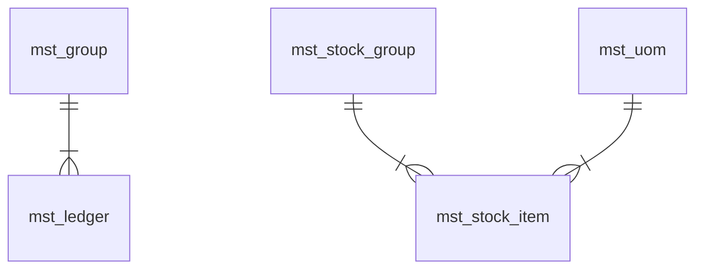
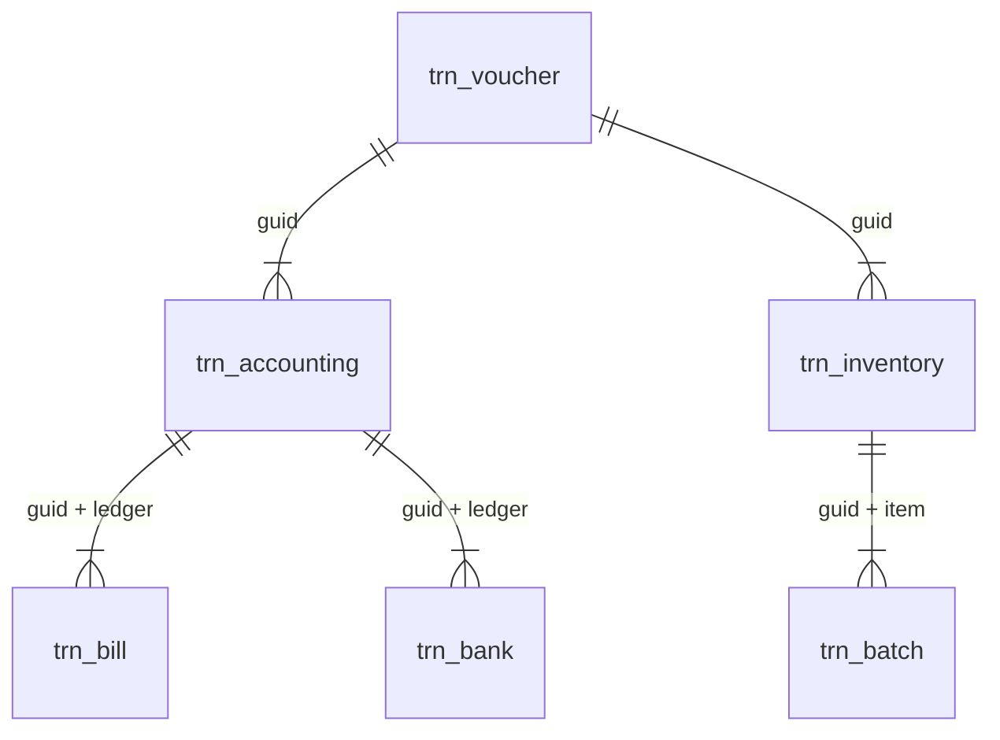
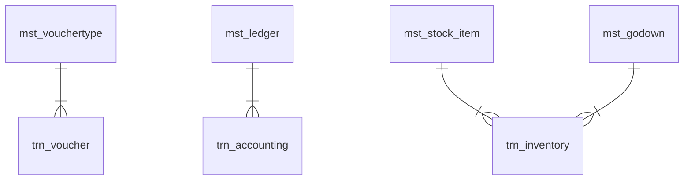
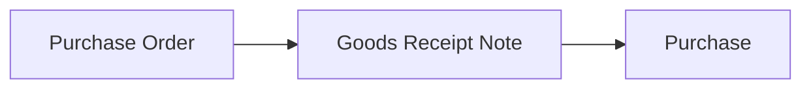
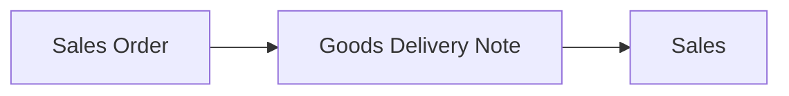
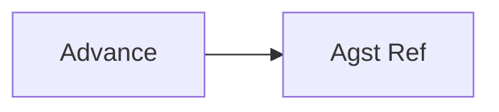

# Data Structure


## Background
Tally has in-house database system, which cannot be accessed using standard RDBMS drivers. It has a hierarchical structure database, where-in few fields are of type table. So as a result, it has table-inside-table structure. Popular RDBMS (Relational DataBase Management System) Server like SQL Server, MySQL, etc does not support hierarchy structure data. So, the utility breaks down data from hierarchy to tabular structure, where tables can be relationally linked to each other.

## Concept of GUID in Tally
Every database system requires primary key, i.e. a field which holds unique value serving as signature to identify that row. Each table in Tally has a field named GUID (Globally Unique IDentifer), which is primary key. It contains a 40 digit text value separated by hyphen. This GUID is used to reference that row in other related tables.

## Logical / Boolean types of fields
Fields with prefix is_ are logical types of field (like _is_deemed_positive_, _is_order_voucher_, etc.). Not all database technology supports logical data type. To maintain consistency, they are defined as numeric, but should be treated as logical. Below is the reference table for their values

|Value|Interpretation|
|---|---|
|0|No / False|
|1|Yes / True|

## Tally vs Utility Data Structure
Tally has 2 types of data in table / sub-table (i.e a table inside a field value)
* Master
* Transaction

Tally Developer contains in details schema / structure of various tables of tally along with field of those tables

In the utility, Master tables have been prefixed with **mst_** and Transaction tables with **trn_** .

Utility splits inferred data from Tally into 2 category of tables
* Primary
* Derived

**Primary**: These are physical tables of Tally Database

**Derived**: These are logical tables derived from Tally Database tables, which resides internally as sub-table inside few fields of primary table. Utility derives them by merging these tables of each row into single table. Certain filter might also be applied while merging this.
<br><br>

## Primary tables of Tally
Below is the mapping of few Primary table of Tally with corresponding table in Utility

| Tally | Utility |
| --- | --- |
| Group | mst_group |
| Ledger | mst_ledger |
| Voucher Type | mst_vouchertype |
| Unit | mst_uom |
| Godown | mst_godown |
| Stock Group | mst_stock_group |
| Stock Item | mst_stock_item |
| Cost Category | mst_cost_category |
| Cost Centre | mst_cost_centre |
| Voucher | trn_voucher |


## Transaction data structure in utility
Tally has primary table named **Voucher**, which utility captures in trn_voucher. This table contains header information of any voucher like Date, Voucher Type, Voucher Number etc. From Voucher, below mentiond tables are derived

```
trn_voucher
    |——— trn_accounting
        |——— trn_cost_centre
        |——— trn_bill
        |——— trn_bank
    |———  trn_inventory
        |——— trn_batch
```

**trn_accounting**: Accounting effects of any voucher (if any) are captured in this table. It has separate row for every debit &amp; credit to ledger of single voucher linked by GUID of voucher from *trn_voucher* table. In case of multiple debit / credit, more than 2 rows would be found.

Amount field contains debit / credit as below
| Amount | Sign |
| --- | --- |
| negative | Debit |
| positive | Credit |

**trn_inventory**: Inventory effects of any voucher (if any) are captured in this table. For every inward / outward effect of individual stock item in voucher, row is found in this table linked to GUID of voucher from *trn_voucher* table.

Quantity fields denotes inward / outward movement as below
| Quantity | Sign |
| --- | --- |
| negative | Outward |
| positive | Inward |

**trn_bill**: This table contains bill-wise breakup of purchase/sale invoice or receipt/payment.

**trn_bank**: This table contains bank allocation for Receipt / Payment / Contra type of vouchers.

**trn_cost_centre**: This table contains cost centre wise breakup for individual debit/credit effect of voucher.

**trn_batch**: This table contains godown-wise breakup for individual inward/outward effect of voucher.

## Relationship
All the tables are related to each other with **one-to-many** relationship. The relationship is not enforced into database, as it hampers bulk data loading into database server. Also, Tally itself takes care of enforcing relationship internally. So, below table can be used for defining relationship required by BI tools like Power BI, Tableau, etc. It is represented into format **table(field)**
|One|Many|
|---|---|
|mst_group(name)|mst_ledger(parent)|
|mst_ledger(name)|mst_opening_bill_allocation(ledger)|
|mst_ledger(name)|trn_closingstock_ledger(ledger)|
|mst_ledger(name)|trn_accounting(ledger)|
|mst_ledger(name)|trn_cost_centre(ledger)|
|mst_ledger(name)|trn_bill(ledger)|
|mst_ledger(name)|trn_bank(ledger)|
|mst_ledger(name)|trn_inventory_accounting(ledger)|
|mst_ledger(name)|trn_cost_category_centre(ledger)|
|mst_ledger(name)|trn_cost_inventory_category_centre(ledger)|
|mst_vouchertype(name)|trn_voucher(voucher_type)|
|mst_uom(name)|mst_stock_item(uom)|
|mst_uom(name)|mst_attendance_type(uom)|
|mst_godown(name)|mst_opening_batch_allocation(godown)|
|mst_godown(name)|trn_inventory(godown)|
|mst_godown(name)|trn_batch(godown)|
|mst_godown(name)|trn_batch(destination_godown)|
|mst_stock_group(name)|mst_stock_item(parent)|
|mst_stock_item(name)|mst_gst_effective_rate(item)|
|mst_stock_item(name)|mst_opening_batch_allocation(item)|
|mst_stock_item(name)|trn_inventory(item)|
|mst_stock_item(name)|trn_batch(item)|
|mst_stock_item(name)|trn_cost_inventory_category_centre(item)|
|mst_cost_category(name)|mst_cost_centre(parent)|
|mst_cost_category(name)|trn_cost_category_centre(costcategory)|
|mst_cost_category(name)|trn_cost_inventory_category_centre(costcategory)|
|mst_cost_category(name)|trn_employee(category)|
|mst_cost_category(name)|trn_payhead(category)|
|mst_cost_centre(name)|trn_cost_centre(costcentre)|
|mst_cost_centre(name)|trn_cost_category_centre(costcentre)|
|mst_cost_centre(name)|trn_cost_inventory_category_centre(costcentre)|
|mst_attendance_type(name)|trn_attendance(attendancetype_name)|
|mst_employee(name)|trn_employee(employee_name)|
|mst_employee(name)|trn_payhead(employee_name)|
|mst_employee(name)|trn_attendance(employee_name)|
|mst_payhead(name)|trn_payhead(payhead_name)|
|trn_voucher(guid)|trn_accounting(guid)|
|trn_voucher(guid)|trn_inventory(guid)|
|trn_voucher(guid)|trn_cost_centre(guid)|
|trn_voucher(guid)|trn_bill(guid)|
|trn_voucher(guid)|trn_bank(guid)|
|trn_voucher(guid)|trn_batch(guid)|
|trn_voucher(guid)|trn_inventory_accounting(guid)|
|trn_voucher(guid)|trn_cost_category_centre(guid)|
|trn_voucher(guid)|trn_cost_inventory_category_centre(guid)|
|trn_voucher(guid)|trn_employee(guid)|
|trn_voucher(guid)|trn_payhead(guid)|
|trn_voucher(guid)|trn_attendance(guid)|

## Relationship Diagram
Below is the ER (Entity Relationship) diagram for better understanding

### Master



### Transaction



### Master vs Transaction


## Voucher Types Effects
There are two types of impacts which voucher might effect
1. Accounting (Financial Impact)
1. Inventory (Stock Impact)

A specific voucher type might have impact on any of them, both or none. Below is the list for reference
|Voucher Type|Accounting|Inventory|
|---|---|---|
|Journal| :heavy_check_mark: ||
|Receipt| :heavy_check_mark: ||
|Payment| :heavy_check_mark: ||
|Contra| :heavy_check_mark: ||
|Purchase| :heavy_check_mark: ||
|Sales| :heavy_check_mark: ||
|Credit Note| :heavy_check_mark: ||
|Debit Note| :heavy_check_mark: ||
|Purchase Order|||
|Sales Order|||
|Receipt Note|| :heavy_check_mark: |
|Delivery Note|| :heavy_check_mark: |
|Stock Journal|| :heavy_check_mark: |

Note: Purchase / Sales voucher has inventory impact only if stock items are used in the voucher.

## Order Vouchers
Order vouchers Purchase Order / Sales Order, are special category of vouchers, which do not have accounting and inventory impact. But, their would emit rows in **trn_accounting** or (and) **trn_inventory**, for data capture purpose. So, it is extremely important to filter them out from both tables, when calculating any accounting or inventory related effects or reports. Tally has in-built field to easily identify such voucher. Kindly use field **is_order_voucher** of table **trn_voucher** to remove such vouchers by applying filter **is_order_voucher = 0** in SQL / Power Query / Excel / or any BI tool.

## Note Vouchers
Tally has two types of Note vouchers
* GRN (Goods Receipt Note)
* GDN (Goods Delivery Note)
Note voucher always have inventory effect. But in certain scenario, these vouchers might emit rows even in table **trn_accounting**, for data capture purpose. So, these type of vouchers need to be excluded from accounting effect calculation.

## Concept of Workflow
In many organizations, certain business processes consists of multiple events, in the form of chain of events captured as individual vouchers. This setup is known as workflow. Following business activities generally has defined workflow, captured as multiple vouchers in Tally Prime as below

### Purchase Workflow


### Sales Workflow


An organization might not follow above workflow to keep things simple. Like, smaller organizations prefer to simply record Purchase & Sales voucher directly. Some organization might skip order vouchers. Also, an organization might not have events in the exact order defined in above workflow, like Sales vouchers might be recorded before Goods Delivery Note voucher.

## Calculation of Accounting Effects from Vouchers
A voucher is central place to capture every transaction. So, while calculating accounting effects in any report, special care needs to be taken to remove effects on non-financial (or non-accounting) transactions recorded in the ERP system. Table **trn_voucher** needs to be used, to identify &amp; filter out such vouchers from calculation using filter expression **(is_order_voucher = 0) AND (is_inventory_voucher = 0)**

Explanation: Receipt &amp; Delivery Note voucher emit rows in **trn_accounting** table in some scenario, where ledgers with amounts are used in it. So, the above expression will exclude both order &amp; inventory type of vouchers, which indirectly results to rows of accounting effects voucher remaining in the table. These fields are not provided in **trn_accounting** to prevent data duplication thereby increasing data storage size. So, user needs apply JOIN (for SQL) or Merge option (for Power Query) of **trn_accounting** table with **trn_voucher** table to effect this filter. Below is the SQL statement for this

```sql
SELECT
	trn_voucher.date, trn_voucher.voucher_number, trn_voucher.voucher_type, trn_accounting.ledger, trn_accounting.amount
FROM trn_accounting
JOIN trn_voucher on (trn_voucher.guid = trn_accounting.guid)
WHERE (trn_voucher.is_order_voucher = 0) AND (trn_voucher.is_inventory_voucher = 0)
```
<br><br>

## Calculation of Inventory Effects from Vouchers
There are three scenario in which logical of calculation of inventory effect differs:

### Workflow not followed at all:
An organization may choose not to use Note Voucher i.e. GDN / GRN. In this scenario, Purchase and Sales voucher is treated as Inward and Outward of stock items respectively. Calculation of inventory effects is quite simple for such scenario. Simply JOIN tables **trn_voucher** and **trn_inventory** using field **guid** , filter out order vouchers from it. Below is the SQL query for this

```sql
SELECT
	trn_voucher.date, trn_voucher.voucher_number, trn_voucher.voucher_type, trn_inventory.item, trn_inventory.quantity
FROM trn_inventory
JOIN trn_voucher on (trn_voucher.guid = trn_inventory.guid)
WHERE trn_voucher.is_order_voucher = 0
```

### Workflow is followed strictly:
This is typically observed in organization which like to follow standard industry practise for better internal control. In such organizatino, employees are not allowed to bypass workflow and must follow chain of events strictly. Technically GRN & GDN signify inward and outward of stock items respectively. Purchase and Sales voucher is used only for invoicing purpose and needs to be ignored. Below is the SQL query for this

```sql
SELECT
	trn_voucher.date, trn_voucher.voucher_number, trn_voucher.voucher_type, trn_inventory.item, trn_inventory.quantity
FROM trn_inventory
JOIN trn_voucher on (trn_voucher.guid = trn_inventory.guid)
WHERE (trn_voucher.is_order_voucher = 0) AND (trn_voucher.is_inventory_voucher = 1)
```

### Workflow is followed partially:
This is the most complicated scenario typically observed in organizations where internal process are not enforced properly. Each employee is at his / her will to follow the process which he / she deems fit OK, leading to generation of messed up ERP data. Also, the process might be followed differently for every party (Sundry Debtor or Sundry Creditor). GRN and GDN voucher might be generated for some Purchase and Sales transaction respectively. And in some transactions, directly Purchase and Sales vouchers might be booked without entering any GRN and GDN. Due to this, it becomes complicated to determine, for which transactions Note vouchers (GRN / GDN) needs to be consider for giving inventory effect and for which transactions, Purchase / Sales voucher needs to be considered for inventory effect. Inventory effect might get doubled due to duplication of rows and needs to be carefully handled.

Tally offers flexibility to skip any event, due to which it gives inventory effect, based on whichever event occurs first. For example, if Sales voucher is recorded in the system before GDN, then it would give inventory effect on the date of Sales voucher ignoring GDN (i.e. whichever occurs first). Similarly if Purchase voucher is recorded in the system before GRN, then it would give inventory effect on the date of Purchase voucher ignoring GRN. So, to ignore duplication of inventory effect in this scenario, **tracking_number** field of table **trn_inventory** needs to be used. Field **tracking_number** is blank for those transactions where GRN / GDN is not used. and assigns some value in **tracking_number** for vouchers where it is used. Below is the SQL query to filter out rows to be considered for inventory effect

```sql
SELECT *
FROM
(
	SELECT
		trn_voucher.date, trn_voucher.voucher_number, trn_voucher.voucher_type, trn_inventory.item, trn_inventory.quantity,
		(CASE WHEN trn_inventory.tracking_number = '' THEN 1 ELSE ROW_NUMBER() OVER(PARTITION BY trn_inventory.tracking_number, trn_inventory.item ORDER BY trn_voucher.date) END) AS repetition
	FROM trn_inventory
	JOIN trn_voucher on (trn_voucher.guid = trn_inventory.guid)
	WHERE trn_voucher.is_order_voucher = 0
) AS T
WHERE t.repetition = 1
```

## Ledger Closing Balance
Tally does not have in-built field for closing balance of ledger account, since it is dynamic &amp; based on the date. Below are the steps to calculate closing balance of any ledger, based on the structure of the data
1. Grab value of field **opening_balance** from table **mst_ledger** for specific ledger by applying filter to **name** field
1. Calculate Net Debit / Credit by joining (SQL) or merging (Power Query) tables **trn_voucher** and **trn_accounting** by using **guid** field, and then apply filter to **ledger** field of table **trn_accounting** and **date** field of **trn_voucher** for closing date. Ensure to apply filter for Accounting Effects, so that Order Vouchers are excluded from output. Below is the SQL query for reference purpose.

```sql
SELECT
	mst_ledger.name,
	SUM(mst_ledger.opening_balance) AS opening_balance,
	SUM(CASE WHEN trn_accounting.amount < 0 then -trn_accounting.amount ELSE 0 END) AS net_debit,
	SUM(CASE WHEN trn_accounting.amount > 0 then trn_accounting.amount ELSE 0 END) AS net_credit,
	(SUM(mst_ledger.opening_balance) + SUM(trn_accounting.amount)) AS closing_balance
FROM trn_accounting
JOIN trn_voucher ON (trn_voucher.guid = trn_accounting.guid)
LEFT JOIN mst_ledger ON (mst_ledger.name = trn_accounting.ledger)
WHERE
	(trn_voucher.is_order_voucher = 0) AND (trn_voucher.is_inventory_voucher = 0)
GROUP BY
	mst_ledger.name
```

Note: Few assumptions for the above SQL query
* Data for single Financial Year was loaded into Database.
* Closing Stock amounts is not dynamically calculated, but directly figure available in opening_balance is taken.
* Current Year Net Profit is not transferred to Profit &amp; Loss Account.

## Closing Stock Value
Tally does not create any voucher entry for the closing stock. Value of closing stock is derived in the following way:
1. If any information is found in Ledger Closing Balance for Stock-in-Hand type of Ledgers, then respective value for that date or nearest earlier date is used. Table **trn_closingstock_ledger** captures rows for the same.
1. Otherwise, Tally calculates closing value for individual stock item based on Weighted Average or FIFO (First In First Out) method as configured for individual stock items.

## Bill-by-Bill tracking
For all the vouchers, where bill-wise breakup is recorded in the voucher entry, corresponding row in the table **trn_bill** will be present. Technically, **trn_bill** table is a subset of **trn_accounting** with breakup of bill names for individual line items of trn_accounting. Both tables are bound by composite key comprising of fields **guid** and **ledger** . Field **name** of table *trn_bill* uniquely identifies a bill. To track bill status, we need to track event chain of any bill. Field **billtype** denotes event of any bill. Values of this billtype field can be:
* New Ref
* Agst Ref
* Advance
* On Account

Generally chain of events can be as below:

### Regular Invoice


**New Ref** when creating *Purchase* or *Sales* voucher. And then adjusting that invoice fully / partially with *Receipt* or *Payment* voucher using **Agst Ref** .


### Invoice with Advance


**Advance** when creating *Receipt* or *Payment* voucher of advance received or paid. And then adjusting that advance fully / partially with respective *Purchase* or *Sales* voucher using **Agst Ref** .

To track the bill status, **trn_bill** table needs to be split into two. Let us call them as left and right table to understand the logic. **Left table** comprises of rows with **billtype** equal to **New Ref** or **Advance** and **Right Table** comprising rows with **billtype** equal to **Agst Ref**. Field **name** connects both Left and Right table. In the Left table, field **name** would be unique, as ERP cannot create a bill twice. But in Right table, duplicate rows for the field **name** might be found when multiple partial payments / receipts are made against the bill. So before comparing both table, right table needs to be aggregated based on **name** field by sum totaling **amount** column. Also, it is possible that for few rows in left table, corresponding rows might not be found in the right table, when no payment or receipt is made for specific bill. So, the logic of tracking needs to be take into account all the mentioned possibilities when tracking. The end result of tracking would be that for corresponding bill in left table, how much amount is found adjusted in the right table. Values with **billtype** as **On Account** needs to be excluded from the entire logic, since it represents vouchers where bill tracking needs to be excluded. Below is the SQL query for reference purpose:

```sql
WITH tblBill AS
(
	SELECT trn_bill.name, trn_bill.amount, trn_bill.billtype
	FROM trn_bill
	JOIN trn_voucher ON trn_voucher.guid = trn_bill.guid
	WHERE (trn_voucher.is_order_voucher = 0) AND (trn_voucher.is_inventory_voucher = 0) AND trn_bill.billtype <> 'On Account'
)
SELECT
	lt.name AS bill_name,
	lt.amount AS bill_amount,
	COALESCE(rt.amount, 0) AS adjusted_amount,
	(lt.amount + COALESCE(rt.amount, 0)) AS pending_amount
FROM
(
	SELECT tblBill.name, tblBill.amount
	FROM tblBill
	WHERE tblBill.billtype IN ('New Ref', 'Advance')
) AS lt
LEFT JOIN
(
	SELECT tblBill.name, SUM(tblBill.amount) AS amount
	FROM tblBill
	WHERE tblBill.billtype = 'Agst Ref'
	GROUP BY tblBill.name
) AS rt ON lt.name = rt.name
```


## Physical Stock voucher anamoly
Tally contains special voucher type named **Physical Stock**. This voucher applys overriding effects to closing stock item inventory balances, breaking down mathematical way of calculating closing stock. Users are advised to refrain from using such unprofessional approach and instead favour booking of stock journal voucher for shortfall / excess founding during physical stock verification process. This will help to maintain analytical system simple and manageable, which provides accurate result.